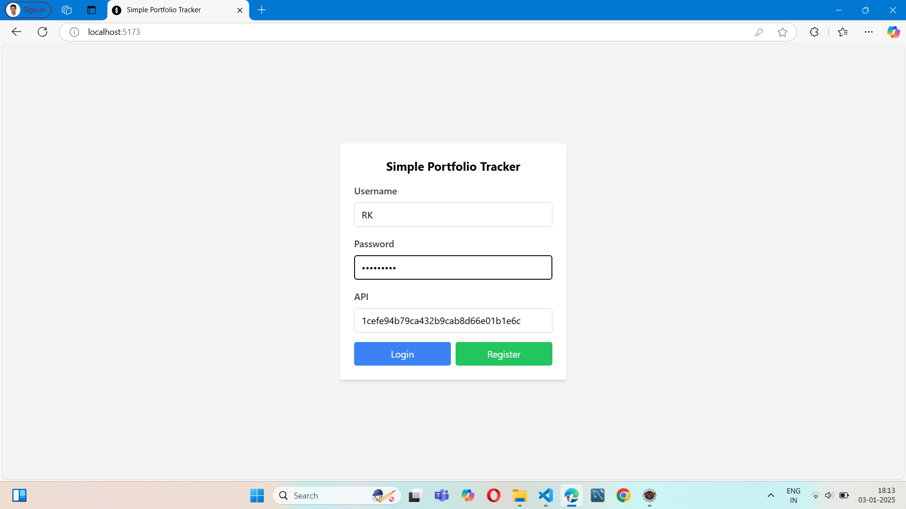
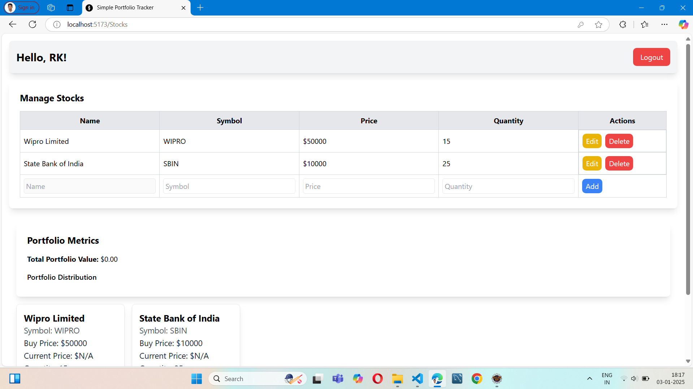
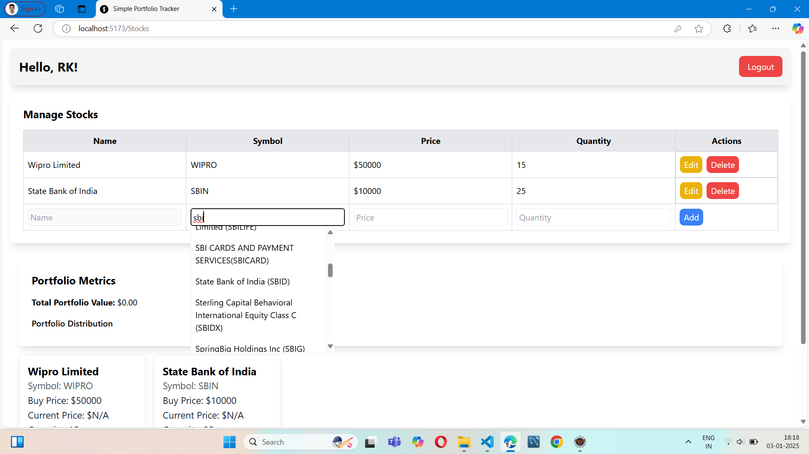
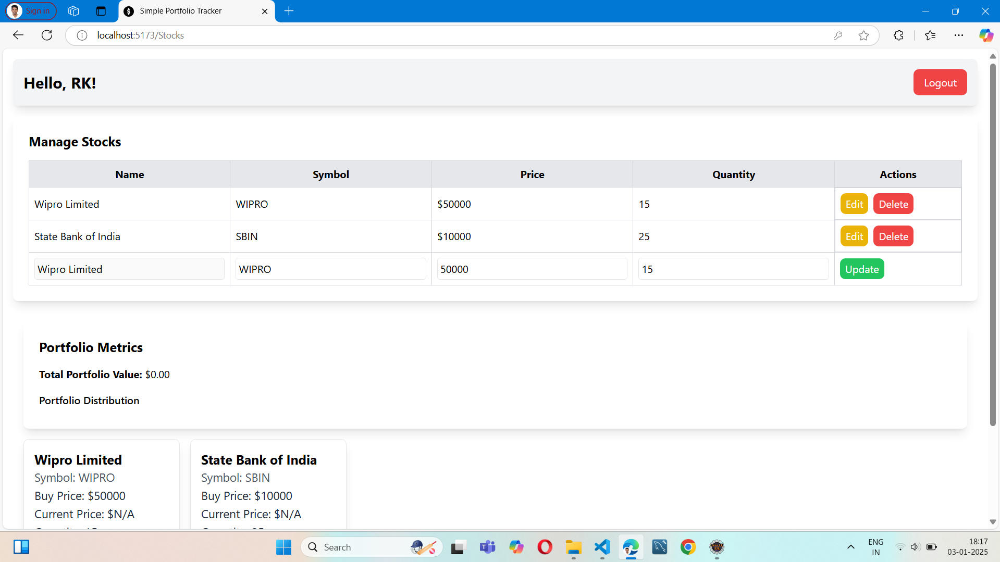

 # Portfolio Tracker

A comprehensive portfolio tracker application that allows users to manage their stock portfolio, fetch stock prices, and calculate portfolio value. Built with a robust frontend and backend, the application provides seamless integration of portfolio management and stock price fetching.
 

## Features

- **Portfolio Management**: Add, update, fetch, and delete stocks in your portfolio.
- **Stock Price Integration**: Get real-time stock prices using the Alpha Vantage API.
- **Portfolio Value Calculation**: Calculate the total value of your portfolio based on the latest stock prices.

## Table of Contents

1. [Install Dependencies](#install-dependencies)
2. [Configuration](#configuration)
3. [Run the Application Locally](#run-the-application-locally)
4. [API Documentation](#api-documentation)

## Install Dependencies

To get started with the application, you'll need to install the necessary dependencies for both the frontend and backend.

### Frontend Setup:

1. Navigate to the `frontend` directory:
    ```bash
    cd frontend
    ```

2. Install the dependencies:
    ```bash
    npm install
    ```

### Backend Setup:

1. Eclipse

## Configuration

### MySQL Setup:

- Create a MySQL database tool for the application.

## Run the Application Locally

### Frontend:
To start the frontend, run the following commands:

```bash
cd frontend
npm start
```

## 🚀 API Documentation

## 🎨 User Interface Walkthrough

Below is a step-by-step guide to navigating through the main features of the **Portfolio Tracker** application, with accompanying visuals to help you understand the workflow.


##  1️⃣ **User Login Interface**

<div align="center">
  
</div>

---

### 2️⃣ **Main Interface**
The main interface provides an overview of your portfolio and key functionalities. You can navigate to add stocks, view portfolio metrics, and analyze graphs.

<div align="center">
  
</div>

---

### 3️⃣ **Adding a Stock**
To add a stock:
- Click the "Add Stock" button.
- Enter the stock details, including **name**, **ticker symbol**, **quantity**, and **buy price**.
- Click **Submit** to add the stock to your portfolio.

<div align="center">
  
</div>

---

### 4️⃣ **Edit and Delete Functionality**
- **Edit**: Modify stock details (e.g., quantity or buy price) to keep your portfolio updated.
- **Delete**: Remove unwanted stocks from your portfolio with a single click.

<div align="center">
  
</div>

---

### 📋 **Steps to Use the Application**
1. **Navigate to the Main Interface**: Begin at the main dashboard to get an overview of your portfolio.
2. **Add a Stock**: Use the "Add Stock" feature to include new investments in your portfolio.
3. **View Portfolio Metrics**: Access the dashboard to track your portfolio's total value and individual stock details.
4. **Edit or Delete**: Modify stock details or remove stocks as necessary to maintain accuracy.

---

This guide ensures a smooth user experience while utilizing all the features of the Portfolio Tracker app. Explore and make the most of your investments!


